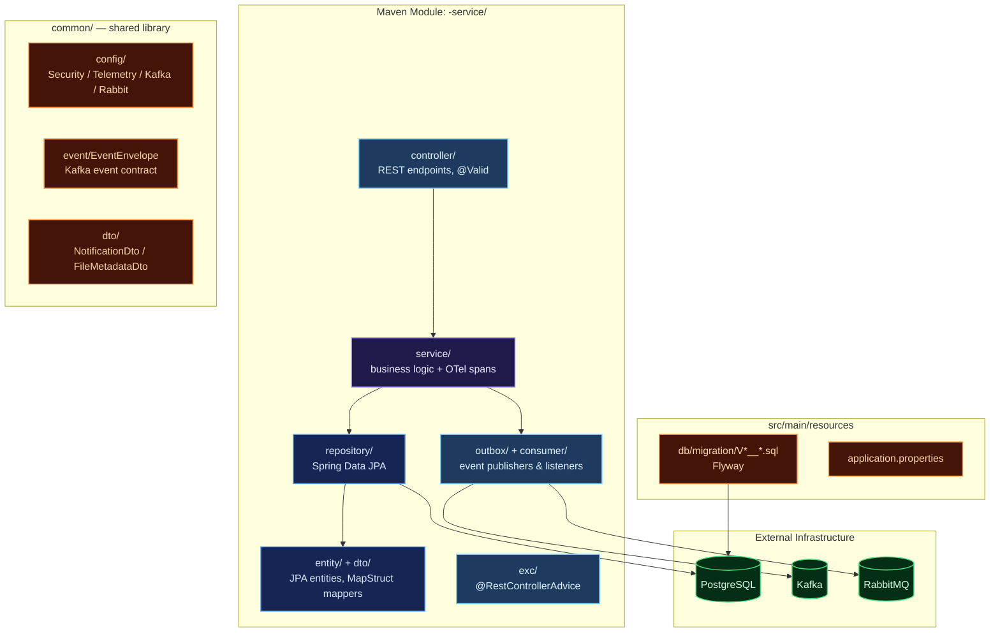
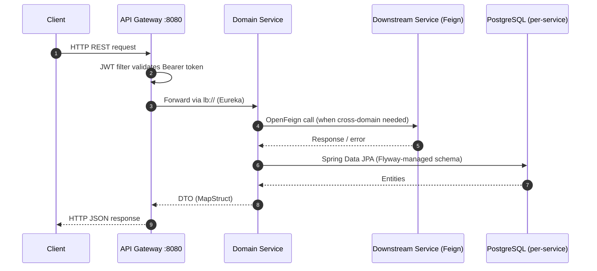
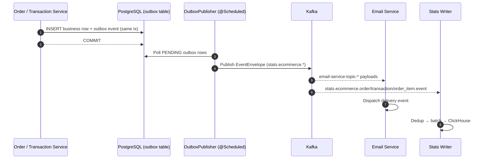
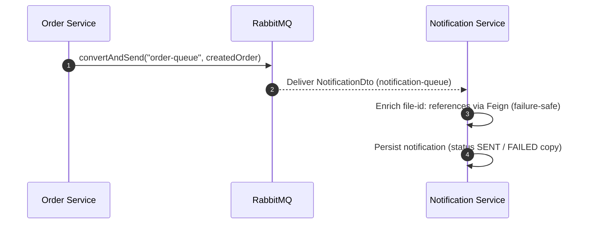

# Distributed Microservices — E-Commerce Platform (Spring Boot Cloud)

A production-grade, fully observable **microservices e-commerce backend** built in **Java 21** on **Spring Boot 3.5.3** and **Spring Cloud 2025.0.0**. Designed around domain-driven service boundaries, each e-commerce business domain — Users, Roles, Auth, Products, Categories, Cart, Orders, Order Items, Shipping, Merchants (5 services), Reviews, Transactions, Banners, Sliders — lives in its own self-contained Maven module, running as an **independent JVM process** with its own REST API, database, and Flyway migrations, achieving true service-level isolation and independent deployability.

Services register with **Netflix Eureka** for service discovery, communicate synchronously via **OpenFeign** REST clients, and asynchronously through **Apache Kafka** (transactional outbox pattern) and **RabbitMQ** (order & notification queues). A **Spring Cloud Gateway** (WebFlux) acts as the unified reactive entry point with JWT authentication at the edge.

The platform ships with a **comprehensive observability suite** (OpenTelemetry Collector, Prometheus, Grafana, Loki, Jaeger, Alertmanager), a **ClickHouse analytics pipeline** (stats-writer → stats-reader → stats-backfill), a per-service **Flyway** migration strategy, and Docker Compose orchestration for the full stack.

---

## Key Features

| Domain | Capabilities |
| :--- | :--- |
| **Auth & Users** | Registration, login with stateless JWT tokens (jjwt), BCrypt password hashing, Feign-backed user lookup for authentication, and per-service Spring Security filter chains. |
| **Roles & RBAC** | Role entities with composite `user_roles` assignments (assign/remove/lookup by user), JPQL role-name projections. |
| **Catalog & Products** | Product CRUD with stock management and image-metadata validation via Feign, category CRUD with auto-derived slugs, promo banners with active-date windows, and home slider carousels. |
| **Cart & Commerce** | Per-user paginated carts, checkout flow in order-service (stock decrease via Feign), order-item decomposition, and shipping address records. |
| **Merchant Suite** | Merchant onboarding with auto-generated merchant numbers & API keys, plus four satellite services: details, business information, policies, and certifications/awards. |
| **Transactions** | Centralized financial ledger with **idempotency-key deduplication** and a Kafka outbox publisher for `transaction.completed` events. |
| **Reviews** | Product ratings (1–5) and per-review media galleries. |
| **Notification & File Storage** | RabbitMQ-driven notification consumer with file metadata enrichment, and a file-storage service exposing file metadata to the platform over Feign. |
| **Email Worker** | Kafka-driven asynchronous worker logging delivery events for registration, forgot-password, merchant onboarding, and transaction invoices. |
| **ClickHouse Analytics** | Columnar analytics for high-performance statistical queries — three-component pipeline: stats-writer (Kafka→ClickHouse), stats-reader (REST→Redis cache), stats-backfill (PostgreSQL→outbox→Kafka→ClickHouse). |
| **Transactional Outbox** | Reliable event publishing — events written to DB within the business transaction, relayed to Kafka by a scheduled OutboxPublisher. Guarantees no event loss during Kafka outages. |
| **Observability** | OpenTelemetry traces/metrics/logs to an OTel Collector, Prometheus metrics, Grafana dashboards, Loki log aggregation, Jaeger tracing, and Alertmanager routing. |
| **Deployment** | Docker Compose orchestration with 22 per-service PostgreSQL databases, RabbitMQ, Kafka, Redis, ClickHouse, and the full observability stack. |

---

## Architecture Overview

The platform implements a **Spring Cloud microservices** architecture. Every business service is a standalone Spring Boot application with its own port, PostgreSQL database, and Flyway migration set. Services register with **Eureka** and resolve each other through load-balanced REST calls (OpenFeign); the **Spring Cloud Gateway** is the single edge router, applying JWT validation per route before forwarding.

### Core Architecture Principles

- **Service-Level Isolation**: One JVM process, one database, one migration chain per business domain. No shared databases between services.
- **Layered Modules**: Each service follows a `Controller → Service → Repository` layering with MapStruct DTO mappers and `@RestControllerAdvice` error handling where present.
- **Service Discovery**: Netflix Eureka registry — services address each other by logical name (`lb://service-name`), no hardcoded hosts in the cluster.
- **Synchronous Communication**: OpenFeign clients (product stock checks, user lookups, order existence checks, file metadata enrichment).
- **Event-Driven Resilience**: Kafka transactional outbox for domain events (order, transaction, order-item) and RabbitMQ queues for order publication and notification delivery.
- **OTel Telemetry**: A shared `TelemetryConfig` (or per-module copy) bootstraps the OpenTelemetry SDK — spans, counters, and histograms (`requests_total`, `requests_duration_seconds`, `failure_total`) are recorded per service operation and exported over OTLP.

```mermaid
graph TB
    classDef client fill:#0f172a,stroke:#38bdf8,color:#e0f2fe,stroke-width:2px,font-weight:bold
    classDef gateway fill:#1e293b,stroke:#22d3ee,color:#cffafe,stroke-width:2px
    classDef domain fill:#1e1b4b,stroke:#818cf8,color:#e0e7ff,stroke-width:1.5px
    classDef infra fill:#172554,stroke:#60a5fa,color:#dbeafe,stroke-width:1.5px
    classDef obs fill:#052e16,stroke:#4ade80,color:#dcfce7,stroke-width:1.5px
    classDef event fill:#431407,stroke:#fb923c,color:#fed7aa,stroke-width:1.5px

    Client["Client Applications<br/>(Web / Mobile / API)"]:::client

    subgraph Edge["Edge Layer"]
        direction LR
        GW["Spring Cloud Gateway<br/>WebFlux Router :8080"]:::gateway
        JWT["JWT Auth Filter<br/>per route"]:::gateway
        EUREKA["Eureka Server<br/>Service Registry :8761"]:::gateway
    end

    Client -->|HTTP REST| GW
    GW -.->|register / resolve| EUREKA

    subgraph BusinessServices["Business Domain Services (Spring Boot)"]
        direction TB

        subgraph IdentityDomain["Identity & Access"]
            AUTH["Auth Service :8085<br/>JWT + Feign to user"]:::domain
            USER["User Service :8084"]:::domain
            ROLE["Role Service :8088<br/>RBAC assignments"]:::domain
        end

        subgraph MerchantDomain["Merchant Suite"]
            MERCH["Merchant Service :8089"]:::domain
            MERCH_DETAIL["Merchant Detail :8100"]:::domain
            MERCH_BIZ["Merchant Business :8099"]:::domain
            MERCH_POLICY["Merchant Policy :8101"]:::domain
            MERCH_AWARD["Merchant Award :8098"]:::domain
        end

        subgraph CatalogDomain["Catalog & Marketing"]
            PROD["Product Service :8082<br/>stock + image validation"]:::domain
            CAT["Category Service :8091"]:::domain
            BANNER["Banner Service :8102"]:::domain
            SLIDER["Slider Service :8107"]:::domain
        end

        subgraph CommerceDomain["Checkout & Cart"]
            CART["Cart Service :8103<br/>paged user baskets"]:::domain
            ORDER["Order Service :8083<br/>checkout + outbox"]:::domain
            OI["Order Item Service :8092"]:::domain
            SHIP["Shipping Address :8106"]:::domain
        end

        subgraph TransactionDomain["Transactions & Reviews"]
            TXN["Transaction Service :8093<br/>idempotency + outbox"]:::domain
            REV["Review Service :8104"]:::domain
            REV_DTL["Review Detail :8105"]:::domain
        end

        subgraph PlatformServices["Platform Services"]
            NOTIF["Notification Service :8086<br/>RabbitMQ consumer"]:::domain
            FS["File Storage :8087<br/>file metadata"]:::domain
        end
    end

    GW -->|REST| AUTH
    GW -->|REST| USER
    GW -->|REST| ROLE
    GW -->|REST| MERCH
    GW -->|REST| PROD
    GW -->|REST| CAT
    GW -->|REST| BANNER
    GW -->|REST| SLIDER
    GW -->|REST| CART
    GW -->|REST| ORDER
    GW -->|REST| TXN
    GW -->|REST| REV
    GW -->|REST| NOTIF
    GW -->|REST| FS

    subgraph Infrastructure["Infrastructure Layer"]
        direction LR
        PG[("PostgreSQL<br/>22 per-service DBs")]:::infra
        RABBIT[("RabbitMQ<br/>:5672")]:::infra
        KAFKA[("Kafka<br/>Event Bus :9092")]:::infra
        REDIS[("Redis<br/>:6379")]:::infra
        CLICKHOUSE[("ClickHouse<br/>Analytics :8123")]:::infra
    end

    AUTH -->|JPA| PG
    USER -->|JPA| PG
    MERCH -->|JPA| PG
    PROD -->|JPA| PG
    ORDER -->|JPA| PG
    TXN -->|JPA| PG
    CART -->|JPA| PG
    REV -->|JPA| PG

    ORDER -->|publish order-queue| RABBIT
    RABBIT -->|consume| NOTIF
    NOTIF -->|Feign| FS

    ORDER -.->|outbox| KAFKA
    TXN -.->|outbox| KAFKA
    KAFKA -->|consume| EMAIL_W

    subgraph EventConsumers["Event-Driven Consumers"]
        EMAIL_W["Email Service :8094<br/>5 Kafka listeners"]:::event
        STATS_W["Stats Writer :8095<br/>batch to ClickHouse"]:::event
    end

    STATS_W --> CLICKHOUSE
    STATS_R["Stats Reader :8096<br/>Redis-cached queries"]:::event
    STATS_R --> CLICKHOUSE
    STATS_R --> REDIS

    subgraph Observability["Observability Stack"]
        direction LR
        OTEL["OTel Collector"]:::obs
        PROM["Prometheus"]:::obs
        LOKI["Loki"]:::obs
        JAEGER["Jaeger"]:::obs
        GRAFANA["Grafana"]:::obs
    end

    AUTH -.->|OTLP| OTEL
    ORDER -.->|OTLP| OTEL
    TXN -.->|OTLP| OTEL
    GW -.->|OTLP| OTEL
    OTEL -.-> JAEGER
    OTEL -.-> PROM
    LOKI -.-> GRAFANA
    PROM -.-> GRAFANA
```



---

## Service Catalog

**29 Maven modules** — 27 runtime services, 1 shared library, 1 seeder:

| # | Service | Module | Port | Responsibility |
| :- | :------ | :----- | :--- | :------------- |
| 1 | Eureka Server | `eureka-server` | 8761 | Service registry |
| 2 | API Gateway | `api-gateway` | 8080 | Spring Cloud Gateway (WebFlux), JWT filter, routing |
| 3 | Common | `common` | — | Shared library: DTOs, EventEnvelope, Kafka/Rabbit/Security/Telemetry config, seeder contracts |
| 4 | Auth | `auth-service` | 8085 | Login/register, JWT issuing (jjwt), Feign to user-service |
| 5 | User | `user-service` | 8084 | User CRUD, `findByUsername` for auth |
| 6 | Role | `role-service` | 8088 | Roles + composite user-role assignments |
| 7 | Merchant | `merchant-service` | 8089 | Merchant onboarding, documents, auto-generated merchantNo/apiKey |
| 8 | Merchant Detail | `merchant-detail-service` | 8100 | Display/cover/logo profile (1:1 per merchant) |
| 9 | Merchant Business | `merchant-business-service` | 8099 | Business type, tax id, employee counts (1:1 per merchant) |
| 10 | Merchant Policy | `merchant-policy-service` | 8101 | Policy types and descriptions |
| 11 | Merchant Award | `merchant-award-service` | 8098 | Certifications and awards |
| 12 | Product | `product-service` | 8082 | Product catalog, stock decrease, image validation (Feign) |
| 13 | Category | `category-service` | 8091 | Categories with slug deduplication |
| 14 | Banner | `banner-service` | 8102 | Promo banners with active windows |
| 15 | Slider | `slider-service` | 8107 | Home carousel slides |
| 16 | Cart | `cart-service` | 8103 | Paged per-user carts, clear-by-ids |
| 17 | Order | `order-service` | 8083 | Checkout (JWT identity → Feign user → Feign stock), RabbitMQ publish, Kafka outbox |
| 18 | Order Item | `order-item-service` | 8092 | Order line items |
| 19 | Shipping Address | `shipping-address-service` | 8106 | Per-order shipping records |
| 20 | Transaction | `transaction-service` | 8093 | Financial ledger, idempotency keys, Kafka outbox |
| 21 | Review | `review-service` | 8104 | Product ratings & comments |
| 22 | Review Detail | `review-detail-service` | 8105 | Review media galleries |
| 23 | Notification | `notification-service` | 8086 | RabbitMQ consumer, file metadata enrichment, persistence |
| 24 | File Storage | `file-storage-service` | 8087 | File metadata API (consumed via Feign) |
| 25 | Email | `email-service` | 8094 | 5 Kafka listeners for delivery events |
| 26 | Stats Writer | `stats-writer` | 8095 | Kafka → dedup → batch → ClickHouse |
| 27 | Stats Reader | `stats-reader` | 8096 | Aggregated queries, Redis cache |
| 28 | Stats Backfill | `stats-backfill` | — | One-shot PostgreSQL → outbox → Kafka backfill |
| 29 | Seeder | `seeder` | — | Idempotent data seeding across domains |

---

## Internal Service Architecture

Every business module follows the same layered layout, keeping domain logic consistent across the platform.



---

## Data & Event Flow

### Synchronous Flow (Gateway → Service → Feign → DB)



### Asynchronous Flow — Kafka (Transactional Outbox)

Order and transaction mutations write domain events to an `outbox` table inside the same database transaction, then a scheduled `OutboxPublisher` relays them to Kafka — guaranteeing no event loss during broker outages.



### Asynchronous Flow — RabbitMQ (Order Publication & Notifications)



---

## Kafka Event Architecture

Events are published through the **transactional outbox** pattern with `EventEnvelope` (eventId, schemaVersion, eventType, occurredAt, domain, payload). Topic contracts live in `common/src/main/java/com/common/kafka/KafkaCommonConfig.java`.

### Topic Registry

| Category | Topics | Producer → Consumer |
| :------- | :----- | :------------------ |
| **Domain Events (3)** | `stats.ecommerce.order.event`, `stats.ecommerce.transaction.event`, `stats.ecommerce.order_item.event` | Order/Transaction outbox → Stats Writer |
| **Email Notifications (5)** | `email-service-topic-auth-register`, `-auth-forgot-password`, `-auth-verify-code-success`, `-merchant-create`, `-merchant-update-status`, `-transaction-create` | Domain services → Email Service |
| **Cross-Domain Cache Invalidation** | `merchant-service-topic-transaction-event`, `transaction-service-topic-merchant-status-event` | Transaction ↔ Merchant |
| **Notification** | `notification-topic` | Platform services → Notification Service |

All topics are provisioned by `KafkaCommonConfig` (3 partitions, replication factor 1) and documented against `KAFKA_AUDIT.md`.

### Outbox Publisher

Each outbox-equipped service runs a `@Scheduled(fixedDelay = 3000)` publisher: poll `PENDING` rows in creation order, send via `KafkaTemplate`, mark `PROCESSED`; after `MAX_ATTEMPTS = 5` failures the row is marked `FAILED` with the last error recorded.

---

## RabbitMQ Queues

| Queue | Producer → Consumer | Payload |
| :---- | :------------------ | :------ |
| `order-queue` | Order Service (controller publish) | Order payload for downstream processing |
| `notification-queue` | Platform services | `NotificationDto` (JSON converter) |

---

## ClickHouse Analytics Layer

| Component | Role | Description |
| :-------- | :--- | :---------- |
| **stats-reader** | Query API (port `:8096`) | Aggregated statistical queries against ClickHouse, Redis-cached with configurable TTL. |
| **stats-writer** | Kafka consumer (port `:8095`) | Consumes `stats.ecommerce.*` topics, deduplicates, batches, and flushes to ClickHouse. |
| **stats-backfill** | Batch loader | Reads historical OLTP rows into outbox tables → Kafka → stats-writer → ClickHouse. |

---

## Observability

All services export OpenTelemetry telemetry to the OTel Collector (`otel.exporter.otlp.endpoint`), which fans out to the storage backends. Prometheus scrapes collector-exposed metrics only — no per-service scrape duplication.

| Pillar | Tool | Purpose |
| :--- | :--- | :--- |
| **Tracing** | OpenTelemetry → Jaeger | End-to-end traces across gateway and services (W3C propagation). |
| **Metrics** | Prometheus + Grafana | OTel-collector scrape target, custom counters/histograms per service. |
| **Logging** | Loki + Logback | Centralized structured logs, queryable via LogQL. |
| **Alerting** | Alertmanager | Routing for latency/error alerts defined in `observability/rules`. |

---

## Testing

The platform carries a **766-test suite, all green**, following a consistent three-layer strategy per module:

| Layer | Tooling | Coverage |
| :---- | :------ | :------- |
| **Service unit tests** | JUnit 5 + Mockito + AssertJ, `OpenTelemetry.noop()` | Happy paths, error contracts, outbox captures, idempotency guards |
| **Controller tests** | Standalone `MockMvc` (no Spring context) | Endpoint mapping, validation 400s, error-path status codes |
| **Repository tests** | `@DataJpaTest` + Testcontainers (`postgres:15-alpine`) + `@ServiceConnection` | Flyway-migrated schema validation, derived queries, constraints |

Existing `@SpringBootTest contextLoads` stubs were replaced by the real suites (they cannot run without the full infrastructure). Testcontainers checks are skipped automatically when Docker is unavailable; the test JVMs pin `docker-java` API 1.44 for Docker Engine 29 compatibility via `src/test/resources/docker-java.properties`.

Run everything:

```bash
mvn -pl common,auth-service,user-service,product-service,order-service,notification-service,role-service,merchant-service,merchant-award-service,merchant-business-service,merchant-detail-service,merchant-policy-service,category-service,banner-service,slider-service,cart-service,order-item-service,transaction-service,review-service,review-detail-service,shipping-address-service,email-service,api-gateway test
```

---

## Getting Started

### Prerequisites

- Java 21 (Temurin)
- Maven 3.9+
- Docker & Docker Compose

### Build

```bash
mvn clean install -DskipTests
```

### Run the full stack

```bash
docker compose up -d
```

This provisions: Eureka, API Gateway, 20 PostgreSQL databases (one per service), RabbitMQ, Kafka, Redis, ClickHouse, the email/stats services, the seeder, and the observability stack (OTel Collector, Prometheus, Grafana, Loki, Jaeger, Alertmanager, node-exporter).

### Local development (single service)

```bash
mvn -pl product-service spring-boot:run
```

Each service registers with Eureka at `http://localhost:8761`; the gateway routes everything through `http://localhost:8080`.

### Verify health

```bash
curl -s http://localhost:8761/actuator/health      # Eureka
curl -s http://localhost:8080/actuator/health      # Gateway
```

---

## Project Structure

```
spring-boot-microservices-ecommerce/
├── api-gateway/            # Spring Cloud Gateway (WebFlux), JWT filter
├── eureka-server/          # Service registry
├── common/                 # Shared DTOs, EventEnvelope, Kafka/Rabbit/Security/Telemetry config
├── auth-service/           # JWT issuing, Feign to user
├── user-service/           # User CRUD
├── role-service/           # Roles + user_roles
├── merchant-service/       # Merchant onboarding + documents
├── merchant-{detail,business,policy,award}-service/
├── product-service/        # Catalog + stock
├── category-service/       # Categories
├── banner-service/         # Promos
├── slider-service/         # Carousels
├── cart-service/           # Baskets
├── order-service/          # Checkout + outbox + RabbitMQ
├── order-item-service/     # Order lines
├── shipping-address-service/
├── transaction-service/    # Ledger + idempotency + outbox
├── review-service/         # Ratings
├── review-detail-service/  # Review media
├── notification-service/   # RabbitMQ consumer + enrichment
├── file-storage-service/   # File metadata
├── email-service/          # Kafka email worker
├── stats-writer/           # Kafka → ClickHouse
├── stats-reader/           # ClickHouse queries + Redis cache
├── stats-backfill/         # Historical backfill
├── seeder/                 # Cross-domain data seeding
├── docker/                 # Compose init scripts
├── deployments/            # Kubernetes manifests
├── observability/          # Prometheus / Loki / OTel / Grafana / Alertmanager config
└── docker-compose.yml      # Full-stack orchestration
```
